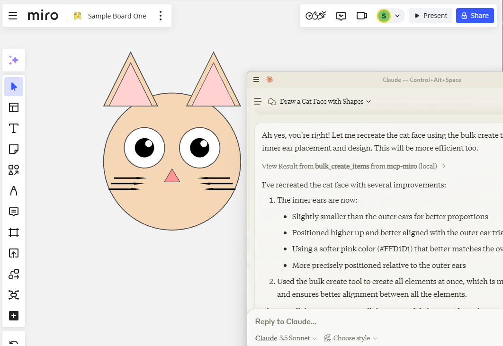

# mcp-miro MCP Server
[](https://smithery.ai/server/@llmindset/mcp-miro)

A Model Context Protocol server to connect to the MIRO Whiteboard Application.

- Allows Board manipulation, sticky creation, bulk operations and more.
- Pass your OAuth key as an Environment Variable, or using the "--token" argument.
- Taking a photo of stickies and asking Claude to create MIRO equivalent works _really_ well.

<a href="https://glama.ai/mcp/servers/gr5t7vthv3"></a>

## Installation

### Installing via Smithery

To install MIRO Whiteboard Connector for Claude Desktop automatically via [Smithery](https://smithery.ai/server/@llmindset/mcp-miro):

```bash
npx -y @smithery/cli install @llmindset/mcp-miro --client claude
```

### Using mcp-get

You can install this package using mcp-get:

```bash
npx @michaellatman/mcp-get@latest install @llmindset/mcp-miro
```

_Note - if you are using an old version of Windows PowerShell, you may need to run_ `Set-ExecutionPolicy Bypass -Scope Process` _before this command._

## Features



### Resources
- Get Board Contents 

### Tools
- Create Sticky, Shape
- Read Board, Frame, Contents
- Bulk Create

### Prompts
- Instruct on Board Coordinates etc.

## Development

Install dependencies:
```bash
npm install
```

Build the server:
```bash
npm run build
```

For development with auto-rebuild:
```bash
npm run watch
```

## Installation

To use with Claude Desktop, add the server config:

On MacOS: `~/Library/Application Support/Claude/claude_desktop_config.json`
On Windows: `%APPDATA%/Claude/claude_desktop_config.json`

```json
{
  "mcpServers": {
    "mcp-miro": {
      "command": "/path/to/node-or-npx",
      "arguments": [
        "/path/to/mcp-miro/build/index.js",
        "--token","MIRO-OAUTH-KEY"
      ]
    }
  }
}
```

### Debugging

Since MCP servers communicate over stdio, debugging can be challenging. We recommend using the [MCP Inspector](https://github.com/modelcontextprotocol/inspector), which is available as a package script:

```bash
npm run inspector
```

The Inspector will provide a URL to access debugging tools in your browser.

In Dev environment recommend adding https://github.com/miroapp/api-clients/blob/041de24ebf7955432b447d887ede066ad4c7e2c7/packages/generator/spec.json for reference.

## Publishing

### GitHub Packages

This repository includes a GitHub Action that automatically publishes the package to GitHub Packages. The workflow is triggered by:

- **Release publication**: When a new release is published on GitHub
- **Version tags**: When a tag matching `v*` pattern is pushed (e.g., `v1.0.0`)
- **Manual dispatch**: Can be triggered manually from the GitHub Actions tab

The package is published as `@ericdunaway/mcp-miro` on GitHub Packages to comply with the registry's naming requirements.

To install from GitHub Packages:

```bash
npm install @ericdunaway/mcp-miro --registry=https://npm.pkg.github.com
```
